# TestShop E-Commerce Flow Diagrams

## 📊 System Overview

```mermaid
graph TB
    subgraph "Client Layer"
        A[Web Browser]
    end
    
    subgraph "API Layer"
        B[Next.js API Routes]
        B1[Auth APIs]
        B2[Product APIs]
        B3[Cart APIs]
        B4[Order APIs]
        B5[Payment APIs]
        B6[Admin APIs]
    end
    
    subgraph "Service Layer"
        C[Prisma ORM]
        D[JWT Auth]
    end
    
    subgraph "Data Layer"
        E[(PostgreSQL Database)]
    end
    
    A --> B
    B --> B1 & B2 & B3 & B4 & B5 & B6
    B1 & B2 & B3 & B4 & B5 & B6 --> C
    B1 --> D
    C --> E
```



---

## 🔐 1. Authentication Flow


---

## 🛒 2. Shopping Flow (Customer Journey)


---

## 📦 3. Product Management Flow (Admin)


---

## 📋 4. Order Management Flow


---

## 🔄 5. Stock Management Flow


---

## 🔧 6. Cart Flow Detail


---

## 📊 7. Admin Dashboard Stats Flow

```mermaid
flowchart TD
    A[Admin Request Stats] --> B{Auth Check}
    B -->|Not Admin| C[403 Forbidden]
    B -->|Is Admin| D[Calculate Period]
    
    D --> E[Query Database]
    
    subgraph "Parallel Queries"
        E --> E1[Count Users]
        E --> E2[Count Products]
        E --> E3[Count Orders<br>by Period]
        E --> E4[Sum Revenue<br>Paid Orders]
        E --> E5[Count Low Stock]
        E --> E6[Recent Orders]
    end
    
    E1 & E2 & E3 & E4 & E5 & E6 --> F[Aggregate Data]
    
    F --> G[Return Stats]
    G --> H[
        {
          summary: {...},
          ordersByStatus: {...},
          recentOrders: [...]
        }
    ]
```

---

## 🌐 8. API Request/Response Flow

```mermaid
flowchart TD
    Request[HTTP Request] --> Route[API Route Handler]
    
    Route --> AuthCheck{Auth Required?}
    AuthCheck -->|Yes| VerifyToken[Verify JWT Token]
    AuthCheck -->|No| SkipAuth[Skip Auth]
    
    VerifyToken --> ValidToken{Valid?}
    ValidToken -->|No| Return401[401 Unauthorized]
    ValidToken -->|Yes| CheckRole{Admin Only?}
    
    CheckRole -->|Yes| IsAdmin{Is Admin?}
    CheckRole -->|No| Continue
    
    IsAdmin -->|No| Return403[403 Forbidden]
    IsAdmin -->|Yes| Continue
    
    SkipAuth --> Continue[Process Request]
    
    Continue --> Validation[Validate Input]
    Validation --> ValidInput{Valid?}
    ValidInput -->|No| Return400[400 Bad Request]
    ValidInput -->|Yes| BusinessLogic[Business Logic]
    
    BusinessLogic --> DBQuery[Database Query]
    DBQuery --> DB[(PostgreSQL)]
    DB --> DBResult[Query Result]
    
    DBResult --> Success{Success?}
    Success -->|No| Return500[500 Server Error]
    Success -->|Yes| FormatResponse[Format Response]
    
    FormatResponse --> Return200[200 OK<br>{success: true, data}]
    
    Return401 & Return403 & Return400 & Return500 --> ErrorResponse[Return Error<br>{success: false, error}]
    
    Return200 & ErrorResponse --> End([End])
```

---

## 📁 Database Schema Relationship


---

## 🎯 Summary

| Flow | Key Features |
|------|-------------|
| **Authentication** | JWT-based, bcrypt password hashing, role-based access |
| **Shopping** | Stock validation, cart persistence, order creation |
| **Admin Products** | CRUD operations, slug validation, usage check before delete |
| **Orders** | Status workflow, stock management, payment integration |
| **Stock** | Real-time validation, auto-deduct on order, restore on cancel |
| **Dashboard** | Aggregated stats, recent orders, low stock alerts |

---

*Generated for TestShop E-Commerce Platform*
